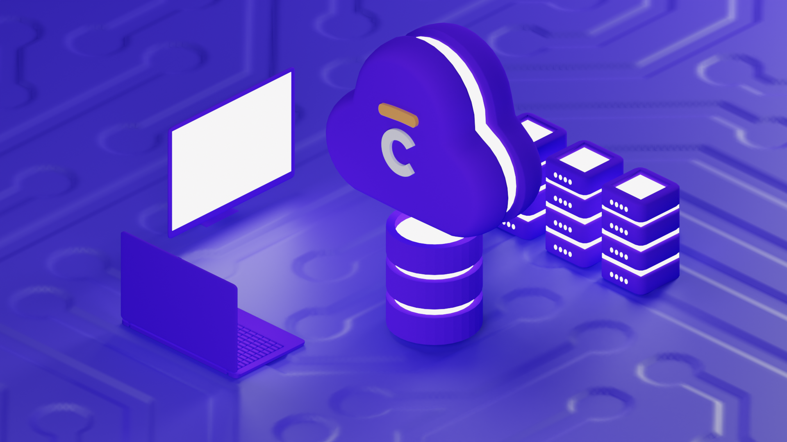

# 🏢 Api Cautioneo !

Bienvenue dans la documentation de l'API Cautioneo !

Vous trouverez ici toutes les informations relative à notre API GraphQL.

Bonne visite !&#x20;

## Envie de tester ?

Vous êtes prêt à faire vos premières requêtes ? [Débuter](debuter-avec-les-api-cautioneo.md)[ immédiatement !](debuter-avec-les-api-cautioneo.md)

## Envie d'approfondir ?

* [Qu'est ce que GraphQL ?](bon-a-savoir/quest-ce-que-graphql.md)
* [Glossaire](bon-a-savoir/glossaire.md)
